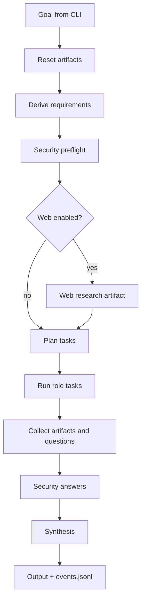

# Architecture Overview

## Purpose
`local_agents` orchestrates role-based LLM agents to produce implementation artifacts and code changes for a target repository.

## Components
- **CLI (`local_agents/__main__.py`)** — entrypoint (`run`, `serve`).
- **Orchestrator (`local_agents/orchestrator.py`)** — phase pipeline coordinator.
- **Role agents (`local_agents/agents.py`)** — per-role execution wrappers over LLM.
- **LLM adapters (`local_agents/llm.py`)** — Ollama and deterministic mock backends.
- **Tools (`local_agents/tools.py`)** — gated repo/shell/web operations.
- **Eventing/UI (`local_agents/events.py`, `local_agents/ui.py`, `local_agents/web.py`)** — JSONL sink + terminal/web monitoring.

## Orchestration flow

## Trust and safety boundaries
- Read policy denylist protects secrets and infrastructure internals.
- Shell commands are allowlisted.
- Patch apply requires git checks and may require interactive approval.
- Artifacts are separated per run to reduce stale context pollution.

## Outputs
- Run logs: `artifacts/events.jsonl`
- Requirements/security artifacts: `artifacts/*.md`
- Patch artifacts: `artifacts/patches/*.diff`
- Materialized file outputs (fallback mode): `artifacts/materialized/*.json`
